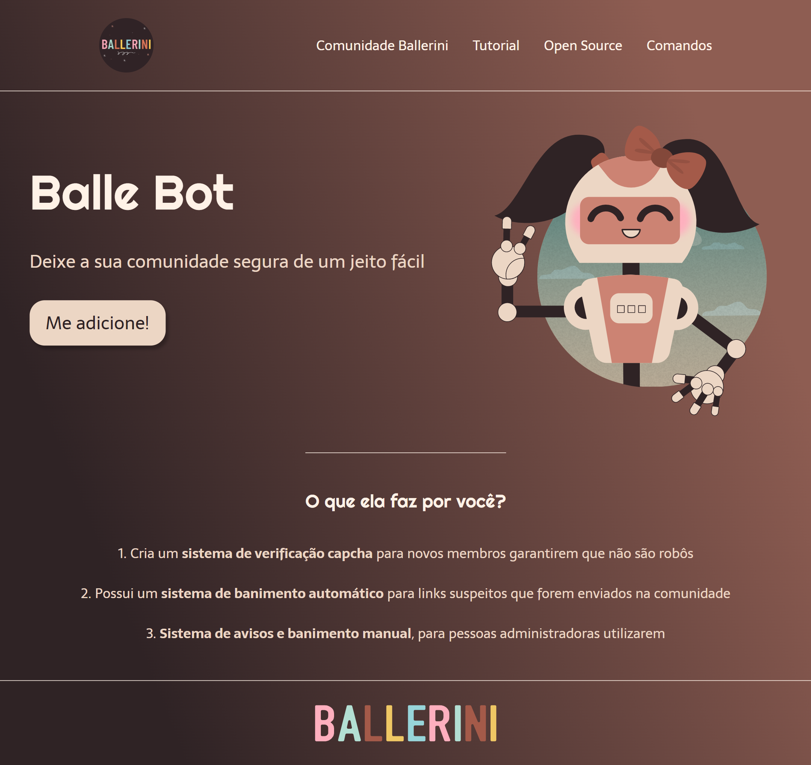

# Balle Bot

## Projeto 💻
Projeto desenvolvido por meio de um vídeo no YouTube do canal da Rafaella Ballerini.

## Layout 🔖
Segue abaixo o layout deste projeto:
- [Figma](https://www.figma.com/file/myqP66iQwzjwjrIAJyyrip/BalleBot)

## Instalação 🛠
Siga esses passos para instalar o repositório na sua máquina:
1. Rode `git clone https://github.com/miishiyama/Balle-Bot` para fazer um clone desse repositório.
2. Abra o arquivo HTML.

## Tecnologias 🚀
- HTML
- CSS
- Google Fonts

## Créditos ❤️
Feito por [Millene Eduarda Ishiyama](https://github.com/miishiyama/).
