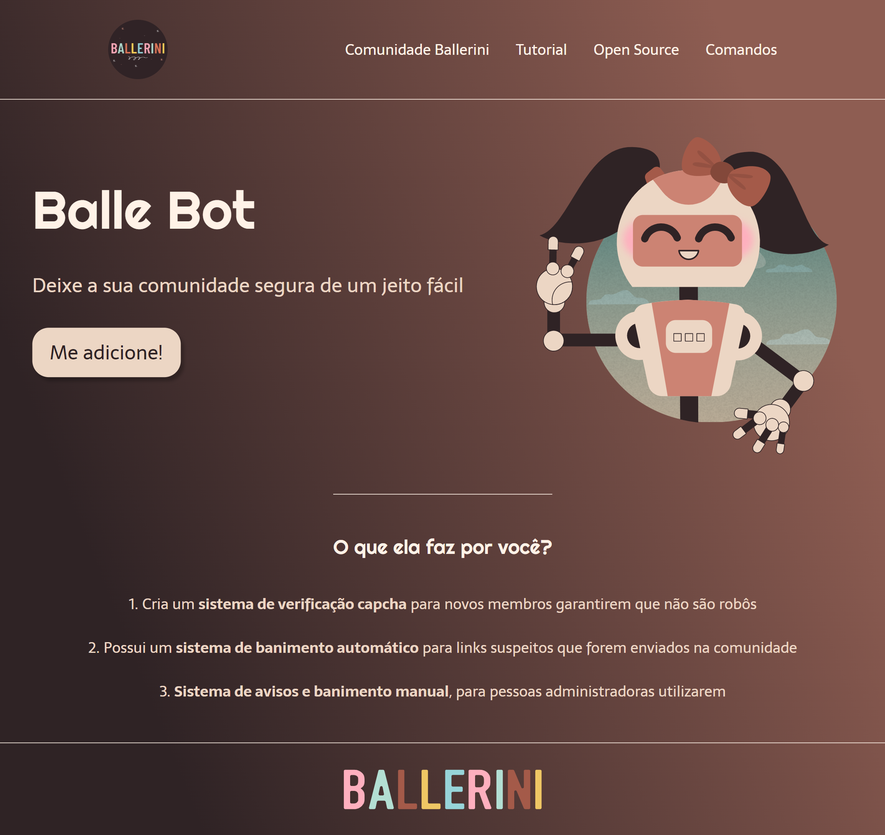

# Balle Bot

## Instalação 🛠
Siga esses passos para instalar o repositório na sua máquina:
1. Rode `git clone https://github.com/miishiyama/Balle-Bot` para fazer um clone desse repositório.

## Projeto 💻
Projeto desenvolvido por meio de um vídeo no YouTube do canal Rafaella Ballerini.  
(https://www.figma.com/file/myqP66iQwzjwjrIAJyyrip/BalleBot)

## Tecnologias 🚀
- HTML
- CSS

## Créditos ❤️
Feito por [Millene Eduarda Ishiyama](https://github.com/miishiyama/).
